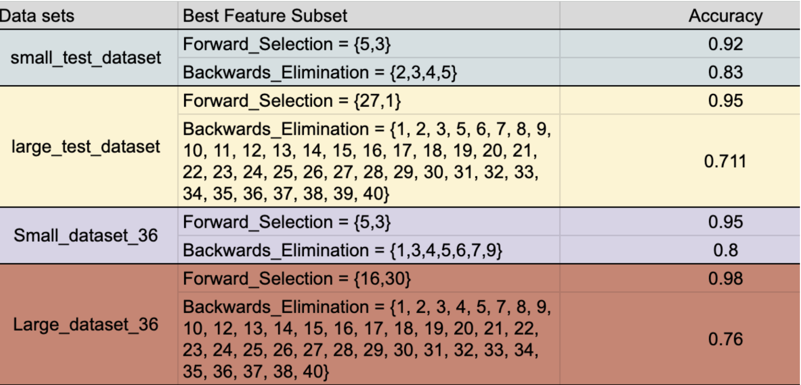
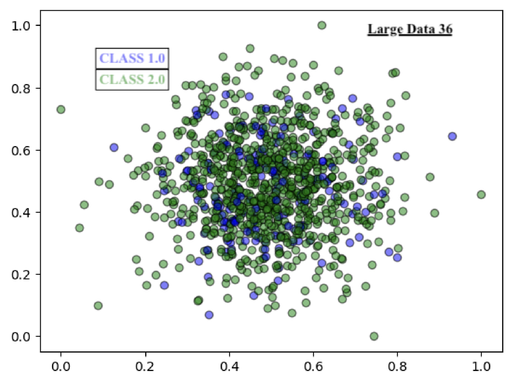
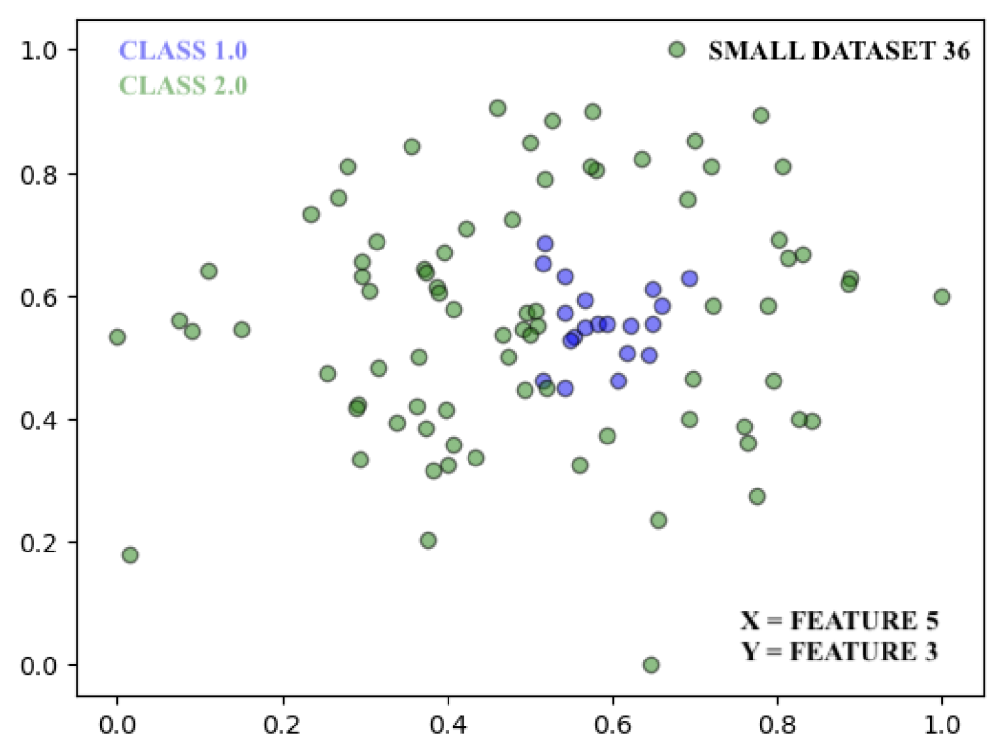

# Nearest Neighbor Classifier

Designed and implemented a Nearest-Neighbor Classifier in Python, employing two greedy algorithms to optimize accuracy. Normalized data using min-max normalization, with accuracy evaluated through k-fold cross-validation.

## Datasets

| Dataset | Instances | Features |
| ------- | --------- | -------- |
| Small   | 100       | 10       |
| Large   | 1000      | 40       |

## Feature Selection

   Feature Selection significantly improves the accuracy of classifiers. When comparing the accuracy results of a classifier using all features to one using a subset we often see an increase in accuracy with the subset.
   
   Feature selection narrows down the features used in classification, leading to faster computation when classifying new instances. Forward Selection tends to reduce the number of features more drastically than Backward Elimination, resulting in shorter future runtimes. However, the significant reduction in features with Forward Selection may indicate potential overfitting.

   The cost of applying feature selection is justified by the accuracy improvement it provides. However, in cases where the accuracy increase is negligible, the expense may not be warranted. Factors such as the desired accuracy, the applicability of the feature subset to future datasets, and the variability of feature values must be considered to avoid overfitting.

   While Forward Selection produces a simpler model with high accuracy, the risk of overfitting is higher. On the other hand, Backward Elimination, though less aggressive in reducing the feature set, minimizes the potential for overfitting, potentially leading to more accurate future classifications.

## Forward Selection
   Forward Feature Search, also known as Forward Selection, is a feature selection technique used in machine learning to improve the performance of a model by selecting the most relevant features. Here's how it works:

### 1. Start with No Features:
   The process begins with an empty model, meaning no features are initially selected.

### 2. Add Features One by One:
   At each step, the algorithm adds the feature that improves the model's performance the most. Performance is usually measured by metrics like accuracy, AUC, or another relevant criterion for the specific task.
   The feature that, when added, provides the greatest improvement to the model's performance is kept.
   
### 3. Repeat Until No Improvement:
   The process continues, adding features one at a time, until adding more features does not significantly improve the model's performance.
   The stopping criterion can be predefined, such as a maximum number of features or a threshold for improvement.

### Result:
   The result is a model that uses only the most important features, leading to better performance and faster computations.

### Advantages:

   - Simplicity: It’s easy to understand and implement.
   - Efficiency: It builds the model iteratively, avoiding the complexity of evaluating all possible feature combinations.

### Disadvantages:

   - Potential for Overfitting: By adding features one at a time, there’s a risk of overfitting especially if too many features are added.

   - Greedy Algorithm: Since it’s a greedy algorithm, it may miss the best combination of features because it only considers adding one feature at a time rather than evaluating all possible combinations.

## Scatter Plots

[^3]: The first column in each dataset are the true classifications of an instance. So there are number of features + 1 cols for each dataset.

